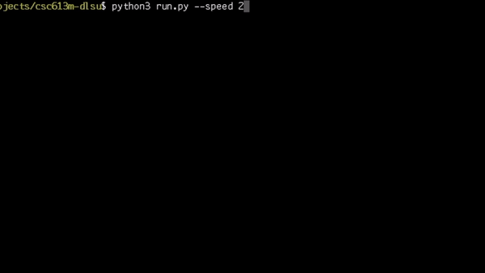
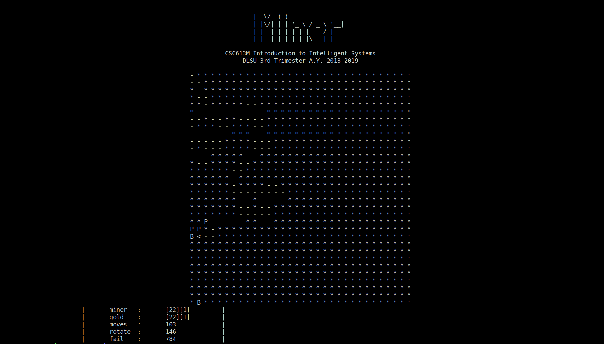
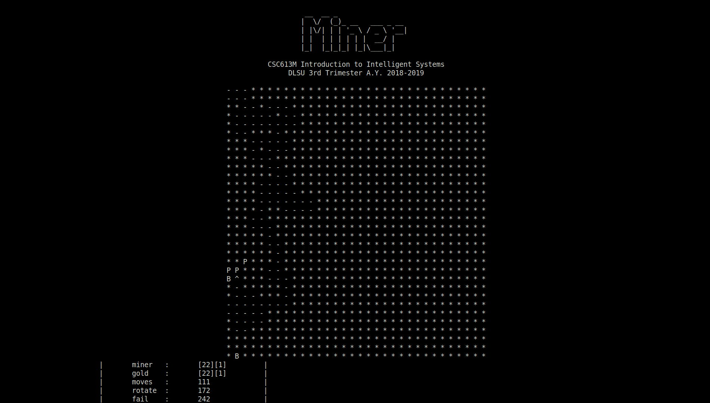
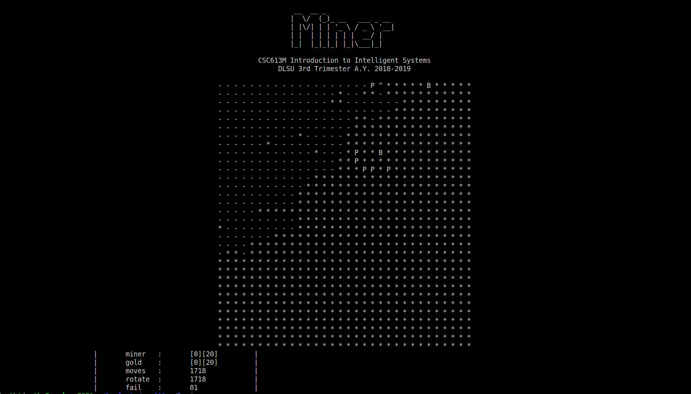
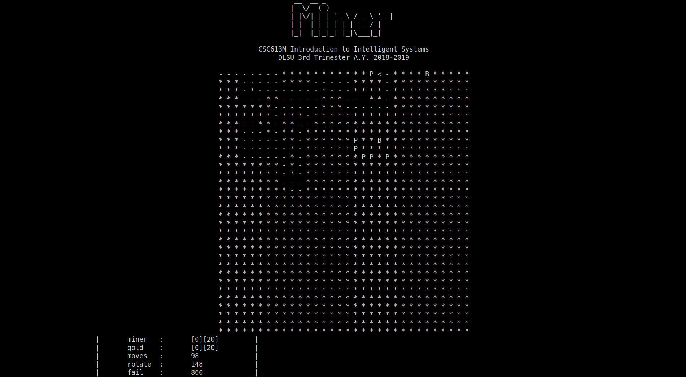
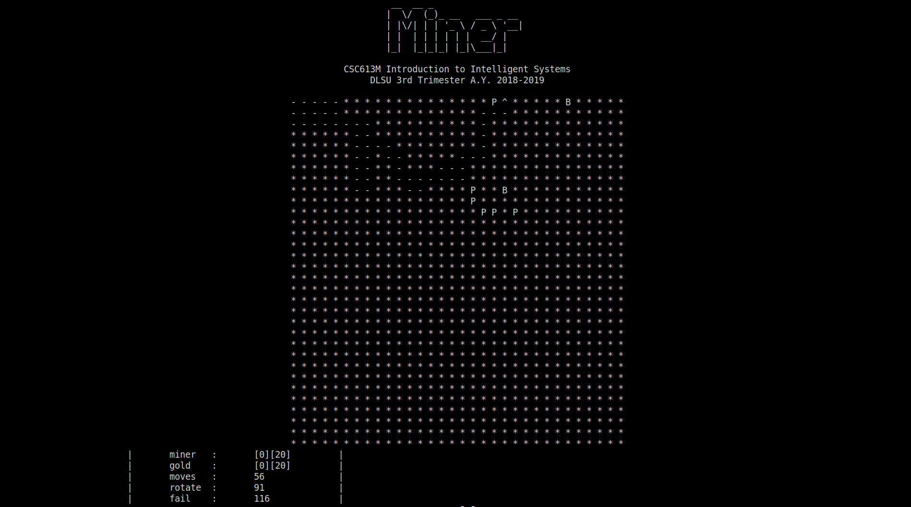

Introduction to Intelligent Systems
===

## A Simple Path-Finding Game System and Evaluation of its Performance

### Usage

This repository is optimized for UNIX-based systems.

```buildoutcfg
$ git clone https://github.com/afagarap/csc613m-dlsu.git/
$ cd csc613m-dlsu
$ sudo apt-get install figlet
```

### Levels of Rationality

We defined three levels of rationality for the agent to determine its path to the goal node.

* Random strategy. The agent randomly moves around the environment until it miraculously reaches the goal node. 
* Recursive strategy. The agent randomly moves around the environment while avoiding its visited nodes until it reaches the goal node.
* Recursive strategy with heuristic. The agent moves around the environment with the guide of the beacon while avoiding its visited nodes until it reaches the goal node.

**Table 1. Performance of the agent with different strategies in an 8x8 environment configuration.**

|Level|Moves|Rotations|Failures|
|-----|-----|---------|--------|
|0|18|18|10|
|1|12|17|14|
|2|10|14|2|




**Figure 1. The solution of strategy 0 to the path-finding problem, reaching the goal node in 18 moves after 10 attempts.**


**Figure 2. The solution of strategy 1 to the path-finding problem, reaching the goal node in 12 moves after 14 attempts.**


**Figure 3. The solution of strategy 2 to the path-finding problem, reaching the goal node in 10 moves after 2 attempts.**

**Table 2. Performance of the agent with different strategies in a 32x32 environment configuration.**

|Level|Moves|Rotations|Failures|
|-----|-----|---------|--------|
|0|1697|1697|14|
|1|103|146|784|
|2|111|172|242|


**Figure 4. The solution of strategy 0 to the path-finding problem, reaching the goal node in 1697 moves after 14 attempts.**



**Figure 5. The solution of strategy 1 to the path-finding problem, reaching the goal node in 103 moves after 784 attempts.**



**Figure 6. The solution of strategy 2 to the path-finding problem, reaching the goal node in 111 moves after 242 attempts.**

**Table 3. Performance of the agent with different strategies in a 32x32 environment configuration.**

|Level|Moves|Rotations|Failures|
|-----|-----|---------|--------|
|0|1718|1718|1|
|1|98|148|860|
|2|56|91|116|



**Figure 4. The solution of strategy 0 to the path-finding problem, reaching the goal node in 1718 moves after 1 attempt.**



**Figure 5. The solution of strategy 1 to the path-finding problem, reaching the goal node in 98 moves after 860 attempts.**



**Figure 6. The solution of strategy 2 to the path-finding problem, reaching the goal node in 56 moves after 116 attempts.**

## An Enhanced Intelligent System and Evaluation of its Performance


