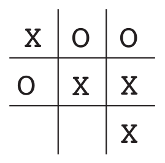

Attaining agent rationality in the game of tic-tac-toe
===

## Preliminaries

### Objective

We take the familiar game of tic-tac-toe where two players take turns playing on a three-by-three board. One player plays Xs and the other Os until a player **wins by placing three consecutive marks horizontally, vertically, or diagonally** (as the X player has in the game shown by Figure 1). If the board is filled up with neither player getting three marks in a row, the game is a draw.

**Figure 1. The tic-tac-toe environment consists of two opposing players, depicting a zero-sum game.**

### Problem Statement

We consider the problem as having a rational agent which is optimized to win the defined environment. Ideally, such a rational agent must consider valid environment states, and the opposing agent actions to maximize its chances of winning the game.
We consider the valid environment states as ones that are not yet occupied by either player, i.e. an empty state, and states that are within the confines of the environment, i.e. 3x3 grid.

## Approaches

* **Random Strategy.** Our first strategy is a random strategy that simulates possible actions in the environment, and valid actions where neither player wins. Its fallback plan is a random action from the valid moves.
* **Lookup Table Strategy.** We improve upon our *random strategy* by integrating the use of a look-up table, where the agent checks and prevents a winning state for the human agent.
* **Minimax Search.** Our third strategy is the minimax search where the goal is for the rational agent to achieve maximal reward value while the human agent must achieve minimal reward value per environment state.
* **Temporal Difference Learning.** Our fourth and final strategy is a reinforcement learning method that learns from an environment through episodes with no prior knowledge of the environment. The agent learns by computing an estimate from an estimate, i.e. it has a look ahead for state-action pairs in the environment.
